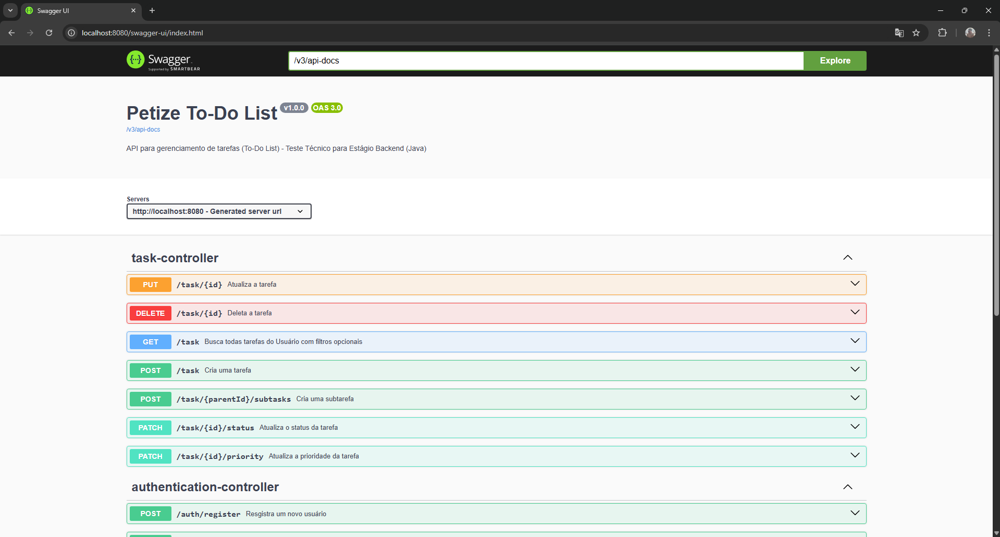

# 📝 To-Do List API - Teste Técnico Estágio Backend

## 📌 Introdução
Este projeto foi desenvolvido como parte do **teste técnico para estágio backend Java** na [Petize](https://petize.com.br).  
O objetivo é implementar uma **API RESTful** para gerenciamento de tarefas (*To-Do List*), permitindo criar, listar, atualizar e excluir tarefas, com autenticação e persistência em banco de dados.

A aplicação segue boas práticas de desenvolvimento e utiliza as seguintes tecnologias:

- **Java 17**
- **Spring Boot**
- **Spring Data JPA**
- **PostgreSQL**
- **Docker & Docker Compose**
- **JWT (JSON Web Token)** para autenticação
- **Swagger** para documentação

---

## ✅ Checklist de Funcionalidades

### Funcionalidades Obrigatórias (conforme edital)
- [x] Criar tarefa com título, descrição, data de vencimento, status e prioridade
- [x] Listar tarefas com filtros por status, prioridade e vencimento
- [x] Atualizar o status da tarefa
- [x] Deletar tarefa
- [x] Impedir conclusão de tarefa com subtarefas pendentes

### Funcionalidades Diferenciais (opcionais implementadas)
- [x] Autenticação JWT com rotas protegidas
- [x] Associações de tarefas por usuário autenticado
- [x] Validação com `@Valid` e mensagens claras
- [x] Documentação com Swagger ou README completo
- [x] Testes unitários e de integração
- [x] Docker Compose com banco de dados
- [x] Paginação e ordenação

---

## 🚀 Como Rodar o Projeto com Docker Compose

### Pré-requisitos
- [Docker](https://docs.docker.com/get-docker/) instalado
- [Docker Compose](https://docs.docker.com/compose/install/) Geralmente já vem incluído na instalação do Docker

### Passo a passo

#### 1. Clonar o repositório
```bash
git clone https://github.com/jhenriquedsm/todolist-petize.git
```

#### 2. Entrar no diretório
```bash
cd todolist-petize
```

#### 3. Subir os containers
```bash
docker-compose up -d
```

Após subir o container e rodar a aplicação, ela estará disponível em:
- API: http://localhost:8080
- Swagger UI: http://localhost:8080/swagger-ui/index.html

---

## 🔑 Autenticação JWT

### 1. Registrar usuário

#### Faça uma requisição POST para o endpoint /auth/register com as credenciais de cadastro.
```bash
POST /auth/register
Content-Type: application/json

{
  "email": "email",
  "password": "password"
}
```

### 2. Gerar Token

#### Faça uma requisição POST para o endpoint /auth/login com as credenciais do usuário criado.
```bash
POST /auth/login
Content-Type: application/json

{
  "email": "email",
  "password": "password"
}
```

#### Resposta
```json
{
  "token": "eyJhbGciOiJIUzI1NiJ9.eyJzdWIiOiJ1c2VyIiwiaWF0IjoxNjc5..."
}
```

### 3. Utilizar o Token

#### Copie o token recebido e utilize-o em ferramentas como o Postman no cabeçalho *Authorization*
- Type: *Bearer Token*
- Token: cole o token gerado aqui

---

## 📡 Endpoints da API

### Endpoints Públicos
| Método | Endpoint       | Descrição                         |
| ------ | -------------- | --------------------------------- |
| POST   | /auth/login    | Realiza login e retorna token JWT |
| POST   | /auth/register | Cadastra novo usuário             |

### Endpoints Protegidos (Exigem Bearer Token)
| Método | Endpoint             | Descrição                                     |
| ------ |----------------------|-----------------------------------------------|
| POST   | /tasks               | Cria nova tarefa                              |
| POST   | /tasks/{id}/subtasks | Cria uma subtarefa                            |
| GET    | /tasks               | Lista todas as tarefas do usuário autenticado |
| GET    | /tasks/{id}          | Obtém detalhes de uma tarefa                  |
| PUT    | /tasks/{id}          | Atualiza informações da tarefa                |
| PATCH  | /tasks/{id}/status   | Atualiza apenas o status                      |
| PATCH  | /tasks/{id}/priority | Atualiza apenas a prioridade                  |
| DELETE | /tasks/{id}          | Remove uma tarefa                             |

### Exemplo de criação de tarefa (POST /tasks)
```json
{
  "title": "Tarefa 1",
  "description": "Descrição da Tarefa 1",
  "dueDate": "2025-12-31",
  "status": "PENDING",
  "priority": "HIGH"
}
```

---

## 📄 Paginação e Ordenação

### Parâmetros de Requisição

Para controlar a paginação e a ordenação, utilize os seguintes parâmetros de consulta (query params) na URL:

- ```page```: O número da página que você deseja visualizar (começando em 0).
  - Exemplo: *?page=0*

- ```size```: O número de itens a serem exibidos por página.
    - Exemplo: *?size=5*

- ```sort```: O campo pelo qual os resultados devem ser ordenados, seguido pela direção (asc para ascendente, desc para descendente).
  - Exemplo *(um campo)*: ?sort=title,asc
  - Exemplo *(múltiplos campos)*: ?sort=priority,desc&sort=dueDate,asc

### Comportamento Padrão

Caso nenhum parâmetro de paginação ou ordenação seja fornecido, a API aplicará o seguinte padrão:

- *Página*: 0
- *Tamanho*: 10 itens por página
- *Ordenação*: Por data de vencimento, em ordem ascendente (dueDate,asc).

Uma requisição para ```GET /task``` é equivalente a ```GET /task?page=0&size=10&sort=dueDate,asc*```.

### Exemplos de Uso

- Buscar a primeira página (página 0) com 5 tarefas:
```bash 
GET http://localhost:8080/task?page=0&size=5
```

- Buscar a terceira página (página 2) e ordenar por título em ordem alfabética:
```bash 
GET http://localhost:8080/task?page=2&size=10&sort=title,asc
```

- Buscar todas as tarefas pendentes, ordenando pelas de maior prioridade primeiro e, em caso de empate, pela data de vencimento mais próxima:
```bash 
GET http://localhost:8080/task?status=PENDING&sort=priority,desc&sort=dueDate,asc
```

### Exemplo de Resposta JSON
A resposta para uma requisição paginada inclui os dados (content) e os metadados da paginação:

```json 
{
  "content": [
    {
      "id": 1,
      "title": "Tarefa",
      "description": "Descrição da tarefa...",
      "dueDate": "2025-08-15",
      "status": "PENDING",
      "priority": "HIGH",
      "user": {
        "id": 1,
        "email": "usuario@email.com"
      }
    }
  ],
  "pageable": {
    "pageNumber": 0,
    "pageSize": 10,
    "sort": {
      "sorted": true,
      "unsorted": false,
      "empty": false
    },
    "offset": 0,
    "paged": true,
    "unpaged": false
  },
  "totalPages": 1,
  "totalElements": 1,
  "last": true,
  "size": 10,
  "number": 0,
  "numberOfElements": 1,
  "first": true,
  "empty": false
}
```

- ```content```: A lista de tarefas da página atual.
- ```totalPages```: O número total de páginas existentes.
- ```totalElements```: O número total de tarefas que correspondem à busca.
- ```number```: O índice da página atual (base 0).

---

## 📖 Documentação Swagger

Toda a documentação completa da API, incluindo descrição detalhada de cada endpoint, parâmetros, tipos de resposta e exemplos, pode ser acessada diretamente no Swagger UI.

- **URL**: [http://localhost:8080/swagger-ui/index.html](http://localhost:8080/swagger-ui/index.html)



> 💡 *Para visualizar o print acima funcionando localmente, basta subir o projeto e acessar o link informado.*

---

## 🤝 Como Contribuir

Contribuições são bem-vindas! Se você deseja melhorar este projeto, por favor, siga os passos:

1.  Faça um **Fork** deste repositório.
2.  Crie uma nova **Branch**: `git checkout -b minha-feature`.
3.  Faça o **Commit** de suas alterações: `git commit -m 'feat: Adiciona minha nova feature'`.
4.  Envie para a sua branch: `git push origin minha-feature`.
5.  Abra um **Pull Request**.

---

## 📜 Licença

Este projeto está sob a licença MIT. Veja o arquivo [LICENSE](LICENSE) para mais detalhes.